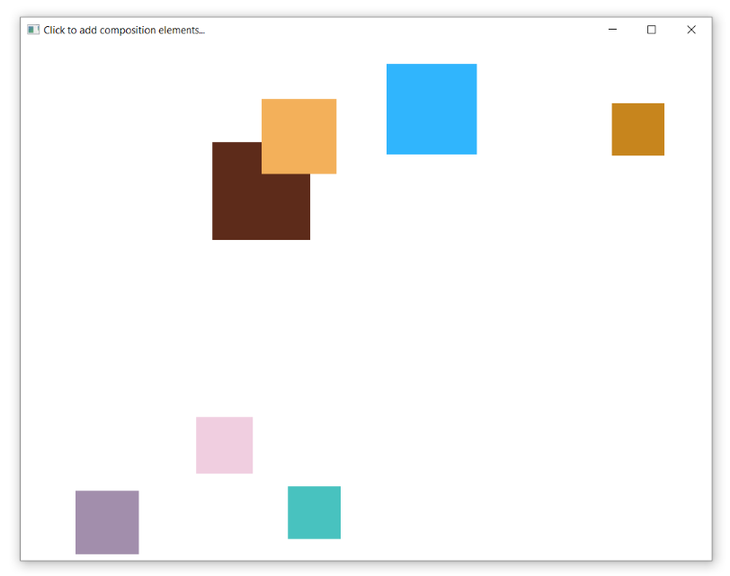

# Rust HelloComposition sample

This sample is adapted from the code created in the [Using the Visual Layer with Win32](https://docs.microsoft.com/windows/uwp/composition/using-the-visual-layer-with-win32) and [Using the Visual Layer with Windows Forms](https://docs.microsoft.com/windows/uwp/composition/using-the-visual-layer-with-windows-forms) tutorials as well as the [minesweeper-rs](https://github.com/robmikh/minesweeper-rs) project. It's a simple user interface (UI) that demonstrates how to add Universal Windows Platform (UWP) [Visual Layer](https://docs.microsoft.com/windows/uwp/composition/visual-layer) content to a Rust app.

The Visual Layer APIs provide a high performance, retained-mode API for graphics, effects, and animations. It's the recommended  replacement for DirectComposition in apps that run on Windows 10.

This sample demonstrates how to set up the interop code needed to use these APIs in a Rust app.



## Features

This sample includes the following features:

- A host module that implements interop between Win32 and UWP Composition APIs.
- Simple use of Composition visuals, brushes, and animations.

## Run the sample

Running this sample requires at least Windows build 1803 (v10.0.17134.0). To compile and run, use [cargo](https://www.rust-lang.org/learn/get-started):

```
cargo run --release
```

## Code at a glance

<!-- ### CompositionHost

The main feature of this sample is the **CompositionHost** class, which contains the code to set up interop between Win32 and the UWP Visual Layer.

The CompositionHost class is written in [C++/WinRT](https://docs.microsoft.com/windows/uwp/cpp-and-winrt-apis/). For more info about using C++/WinRT with an existing C++ Win32 desktop app, see [Get started with C++/WinRT - Modify a Windows Desktop application project to add C++/WinRT support](https://docs.microsoft.com/windows/uwp/cpp-and-winrt-apis/get-started#modify-a-windows-desktop-application-project-to-add-cwinrt-support). -->

## See also

- [Visual Layer documentation](https://docs.microsoft.com/windows/uwp/composition/visual-layer)
- [Windows.UI.Composition](https://docs.microsoft.com/uwp/api/windows.ui.composition)
